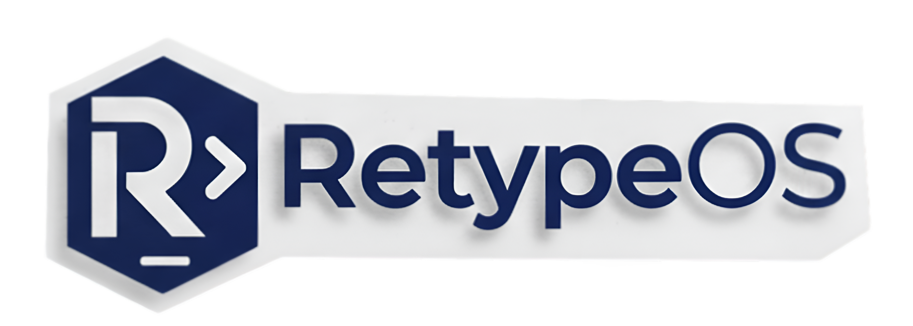

  

<h1 align="center">Welcome to RetypeOS</h1>

  <strong>Re-imagining the Developer's Operating System.</strong>
   
  We build intelligent, ergonomic, and powerful tools to eliminate friction from complex development workflows.

---

## Mission

In a world of diverse technologies and sprawling projects, context switching is the silent killer of productivity. Our mission is to create a unified control plane for your entire development ecosystem, allowing you to focus on what truly matters: building great software. Our tools are designed to be orchestrators, not replacements, enhancing the power of the tools you already love.

## ✨ Our Flagship Project

| Project | Description | Stars |
| :--- | :--- | :--- |
|  | The universal remote control for your development workflow. An intelligent, hierarchical orchestrator that unifies your command-line tools with a simple, consistent language. |  |

## 🤝 How to Contribute

We are building RetypeOS for the community, with the community. Whether you're fixing a bug, proposing a new feature, or improving our documentation, your contributions are welcome!

1. **Read our [Contribution Guidelines](https://github.com/RetypeOS/.github/blob/main/CONTRIBUTING.md)** to get started.
2. **Review our [Code of Conduct](https://github.com/RetypeOS/.github/blob/main/CODE_OF_CONDUCT.md)** to understand our community standards.
3. **Explore our projects** and look for issues tagged `good first issue` or `help wanted`.

We believe in building a welcoming and inclusive community. Join us in shaping the future of developer tooling!
